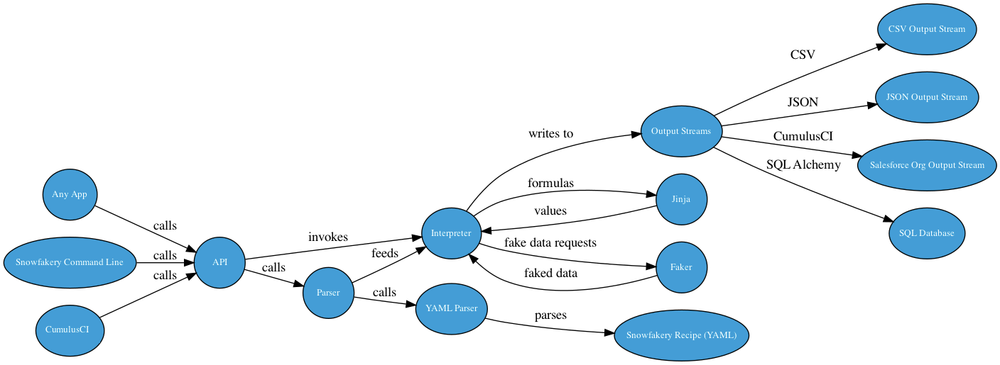

# Snowfakery Architecture

Note: This document covers the Snowfakery interpreter, and not the Snowfakery CCI task. The Snowfakery CCI task will be documented in its repo.

The Snowfakery interpreter reads a recipe, translates it into internal data structures, executes it and then generates recipe output by sending output rows to an "output stream". The output stream formats them into a concrete formats like SQL, JSON, CSV etc.



Obviously, Snowfakery architecture will be easier to understand in the context of the language itself, so understanding the syntax is a good first step.

## Levels of Looping

Snowfakery recipes are designed to be evaluated over and over again, top to bottom. Each run-through is called
an _iteration_.

Snowfakery is designed to be embedded into applications -- like CCI -- which use a 'start-stop-start-stop' pattern. We call the starts and stops _continuations_.

This is useful for generating chunks of data called _portions_, and then handing off those portions to the parent application to let it do the next step.

Here is the overall pattern:

| CumulusCI     | Snowfakery | Data Loader |
| ------------- | ---------- | ----------- |
| Generate Data | Start      | Wait        |
| Load Data     | Stop       | Start       |
| Generate Data | Start      | Stop        |
| Load Data     | Stop       | Start       |
| Generate Data | Start      | Stop        |
| Load Data     | Finish     | Start       |
| Load Data     | Finished   | Finish      |

Note that every time you Start and Stop Snowfakery, you generate a whole new Interpreter object, which re-reads the recipe. In some contexts, the new Intepreter object may be in a different process or (theoretically) on a different computer altogether.

Of course this does raise the question of why you could not do the two in parallel, and the
modern Snowfakery task does do that, but the continuation mechanism is still used for the
following reason.

Consider this recipe:

```yaml
- object: Account
  nickname: Tata
  just_once: True
  fields:
    name: Tata

- object: Employee
  fields:
    reference: Account
```

Imagine if we needed to run this Snowfakery recipe 10,000,000 times in 12 simultaneous processes. Even so, there is one execution of the recipe which is special and that's the= first one, where the Tata Account is created.

So Snowfakery would run it once snapshot the "continuation state" and then fan that continuation state out to the 12 simultaneous processes.

When reading Snowfakery code, you must always think about the lifetime of each data structure:

- Will it survive for a single iteration, like local variables? We call these Transients.
- Will it survive for a single continuation, like "FakerData" objects? We could call these Interpreter Managed objects.
- Will it be saved and loaded between continuations, and thus survive across continuations? These are Globals.

## The Parser

Snowfakery uses a recursive-descent "parser" to translate the YAML to its own internal data structures.
The parser generates an object called a [ParseResult](https://github.com/SFDO-Tooling/Snowfakery/search?q=%22class+ParseResult%22).

The ParseResult is [analyzed](https://github.com/SFDO-Tooling/Snowfakery/search?q=parse_result+parse_recipe&type=code) and then used as input to the Interpreter.

## The Interpreter Object

The [Interpreter](https://github.com/SFDO-Tooling/Snowfakery/search?q=%22class+Interpreter%22&type=code)
is executed once per continuation (or just once if the recipe is not continued).

The Interpreter mediates access betewen the recipe (represented by the ParseResult) and resources
such as:

- the Output Stream
- Global persistent data that survives continuations by being saved to and loaded from YAML
- Transient persistent data that is discarded and rebuilt (as necessary) after continuation
- The Row History which is used for allowing randomized access to objects for the `random_reference` feature
- Plugins and Providers which extend Snowfakery
- Runtime Object Model objects

On my relatively slow computer it takes 1/25 of a second to initialize an Interpreter from a Recipe once all modules are loaded. It takes about 3/4 of a second to launch an interpreter and load the corre, required modules.

### The Runtime Object Model

[Runtime Object Model](https://github.com/SFDO-Tooling/Snowfakery/blob/main/snowfakery/data_generator_runtime_object_model.py) objects are created by the parser and represent recipe constructs.

For example, a VariableDefinition represents this structure:

```
    - var: Foo
      value: Bar

```

An ObjectTemplate represents this one:

```
- object: XXX
```

And so forth.

The Runtime Object Model objects are all managed as part of the `ParseResult` in the `parse_result.statements` list.

### Globals

Mutable data that should be remembered across continuations is stored in the `Globals` variable and is
saved to YAML when a continuation file is created.

The code for Globals shows what exactly is saved, in detail. But you can see what specifically is saved like this:

```
snowfakery recipe.yml --generate-continuation-file /tmp/continue.yml
```

The file looks like this:

```yaml
id_manager:
  last_used_ids:
    Account: 2
    Contact: 2
    Opportunity: 5
intertable_dependencies:
  - field_name: AccountId
    table_name_from: Contact
    table_name_to: Account
  - field_name: AccountId
    table_name_from: Opportunity
    table_name_to: Account
nicknames_and_tables:
  Account: Account
  Contact: Contact
  Michael: Contact
  Opportunity: Opportunity
  bluth_co: Account
persistent_nicknames:
  Michael:
    _tablename: Contact
    _values:
      FirstName: Michael
      LastName: Bluth
      id: 1
  bluth_co:
    _tablename: Account
    _values:
      Description: Solid as a rock
      Name: The Bluth Company
      NumberOfEmployees: 6
      id: 1
persistent_objects_by_table:
  Account:
    _tablename: Account
    _values:
      Description: Solid as a rock
      Name: The Bluth Company
      NumberOfEmployees: 6
      id: 1
  Contact:
    _tablename: Contact
    _values:
      FirstName: Michael
      LastName: Bluth
      id: 1
today: 2022-06-06
```

This also shows the contents of the Globals object. Things we track:

- The last used IDs for various Tables, so we don't generate overlapping IDs
- Inter-table dependencies, so we can generate a CCI mapping file or other output schema that depends on
  relationships
- Mapping from nicknames to tablenames, with tables own names being registered as nicknames for convenience
- Data from specific ("persistent") objects which the user asked to be generated just once and may want to refer to again later
- The current date to allow the `today` function to be consistent even if a process runs across midnight (perhaps we should revisit this)

### Transients

If data should be discarded on every iteration (analogous to 'local variables' in a programming language) then it should be stored in the Transients object which is recreated on every iteration. This object is accessible through the Globals but is not saved to YAML.

### Row History

RowHistory is a way of keeping track of the contents of a subset of all of the rows/objects generated by Snowfakery in a single continuation.

There are a few Recipe patterns enabled by the row history:

- `random_reference` lookups to nicknames
- `random_reference` lookups to objects that have data of interest, such as _another_ `random_reference`

Row History data structures survive for as long as a single process/interpreter/continuation. A new
continuation gets a new Row History, so it is not possible to use Row History to make links across
continuation boundaries.

RowHistory is backed by SQLite with a temporary database which will spill to disk if memory limits are hit.

Here is the kind of recipe that might blow up memory:

```yaml
# examples/random-reference-stress-test.yml
- object: target
  count: 100_000_000
  fields:
    name: ${{id}} row
    bloat: ${{name * 10 ** 7}}

- object: test-random-reference
  count: 1
  fields:
    ref:
      random_reference: target
    name: ${{ref.bloat}}
```

The second object picks from one of a 100M unique strings
which are each approx 80M in size. That's a lot of data and
would quickly blow up memory.

If we actually run this recipe we can see that RAM stays
stable about 127MB and disk space fills gradually (by design).

The RowHistory database is stored in an unlinked file, so
you must use `lsof` rather than `ls` to probe the file size.

Static analysis of the recipe determines which tables have
a row history table behind them. Tables which are not
referenced by `random_reference` do not need a backing
table.

## Fake Data

Snowfakery gets most of its fake data infrastructure from the Python [faker](https://faker.readthedocs.io/en/master/) project.

All Fake Data is mediated through the [FakeData](https://github.com/SFDO-Tooling/Snowfakery/search?q=%22class+FakeData%22) class. Localized FakeData objects can be constructed for different world regions. There is a method on the `Interpreter` object called `faker_template_library` which creates them lazily.

Snowfakery extends and customizes the set of fake data providers through its [FakeNames](https://github.com/SFDO-Tooling/Snowfakery/search?q=%22class+FakeNames%22) class. For example, Snowfakery's email address provider incorporates the first name and last name of the imaginary person into the email. Snowfakery renames `postcode` to `postalcode` to match Salesforc conventions. Snowfakery adds timezones to date-time fakers.

## Formulas

Snowfakery `${{formulas}}` are Jinja Templates controlled by a class called the [`JinjaTemplateEvaluatorFactory`](https://github.com/SFDO-Tooling/Snowfakery/search?q=%22class+JinjaTemplateEvaluatorFactory%22). The `Interpreter` object keeps a reference to this class.

## Continuations

Recall that there are multiple [Levels of Looping](#levels-of-looping). Data which
survives beyond continutation (process) boundaries lives in continuation files.
You can see how that works here:

```sh
$ snowfakery foo.yml --generate-continuation-file /tmp/continue.yml && snowfakery foo.yml --continuation-file /tmp/continue.yml

$ cat /tmp/continue.yml
```

The contents of `/tmp/continue.yml` are specific to a version of Snowfakery and subject
to change over time.

In general, it saves the contents of `just_once` objects and recently created
objects.
