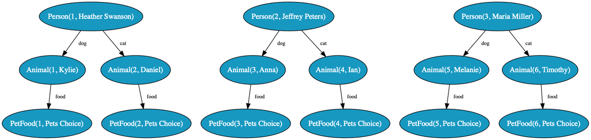
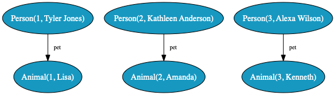
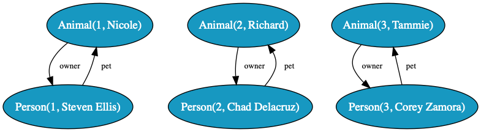
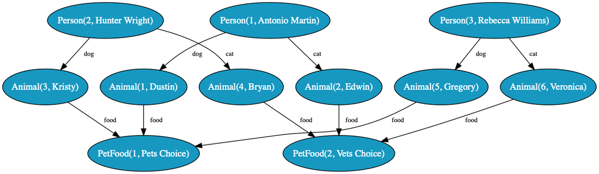
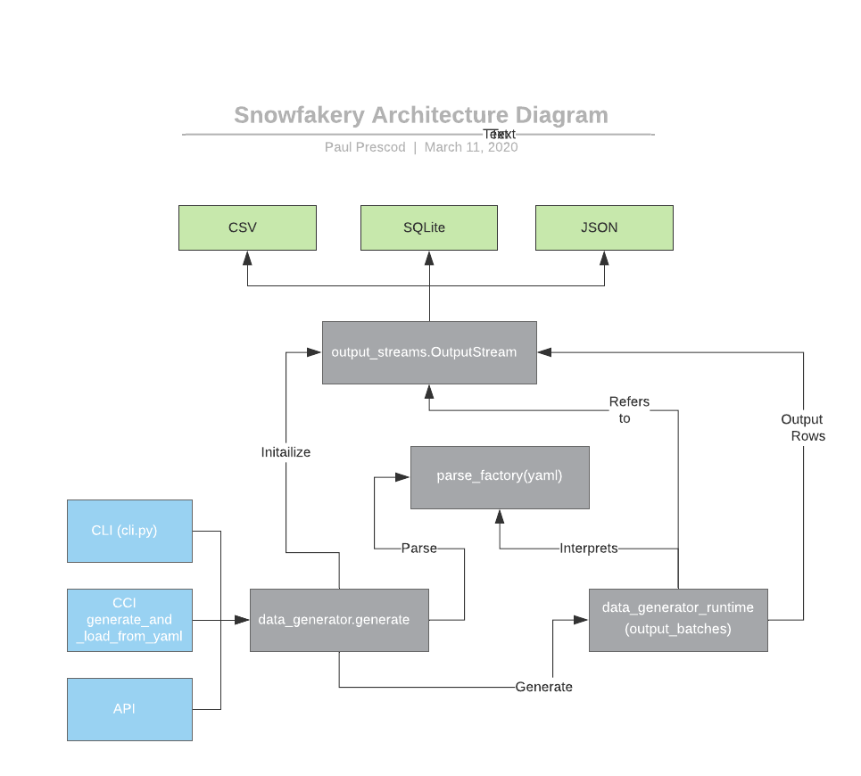
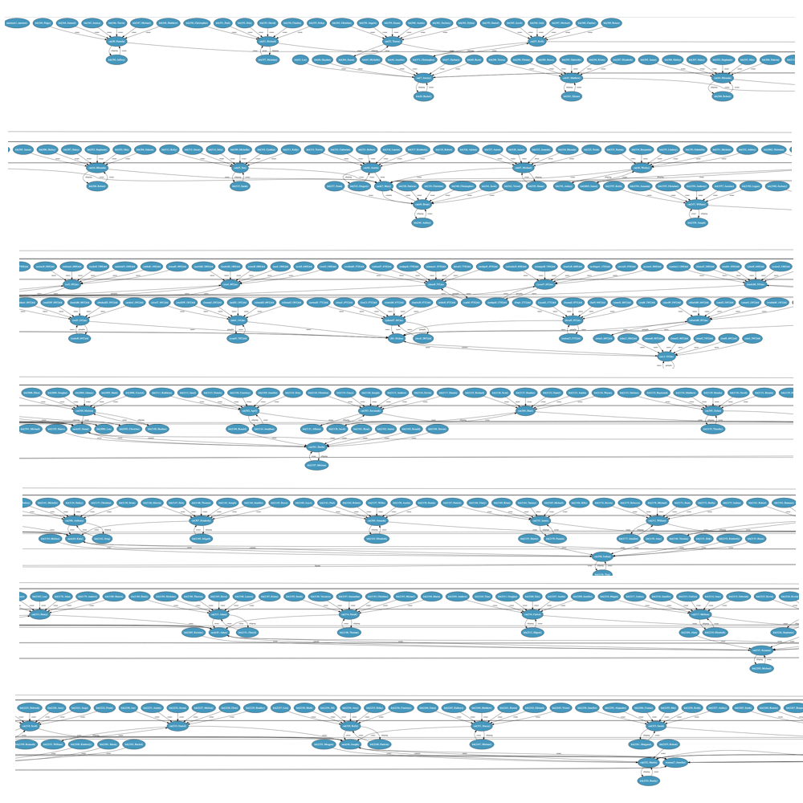

# Snowfakery Documentation

Snowfakery is a tool for generating fake data that has relations between tables. Every row is faked data, but also unique and random, like a snowflake.

To tell Snowfakery what data you want to generate, you need to write a Recipe file in YAML.

Snowfakery can write its output to stdout, or any database accessible to SQLAlchemy. **When it is embedded in CumulusCI it can output to a Salesforce org**. Adding new output formats is a fairly straightforward process.

## Installation

Please start by installing Python. Whether or not you are installing CumulusCI, you can install Python by using the instructions from the [CumulusCI site](https://cumulusci.readthedocs.io/en/latest/install.html).

But while you’re at it, why not install CumulusCI too?

Next, you can go to a terminal and install Snowfakery:

```bash
$ pip3 install pipx
...
$ pipx install snowfakery
...
```

If you want to use Snowfakery within CumulusCI, you can find instructions for that in [Using Snowfakery within CumulusCI](#using-snowfakery-within-cumulusci).

After installation, you should be able to invoke Snowfakery like this:

```bash
$ snowfakery somefile.yml
...
```

## Central Concepts

Snowfakery recipes are specified in a YAML format. YAML is a relatively simple, human-readable format. You can learn more about it at [yaml.org](http://yaml.org/). But you can also just pick up the basics of it by reading along with the examples below.

YAML uses indentation to say which parts of the file are related to each other. Let’s get started with a stupidly simple example recipe:

simple_static.yml

```yaml
- object: Person
  fields:
    name: Buster Bluth
    age: 35
```

We run this example through Snowfakery like this:

```bash
$ snowfakery docs/examples/simple_static.yml
...
```

This simple example will generate a single record that looks like this:

```json
Person(id=1, name=Buster Bluth, age=35)
```

In other words, it is a person record with 3 fields:

|Field    |id   |name         |age|
|---      |---  |---          |---|
|Value    |1    |Buster Bluth |35 |

Two of the fields include data from the YAML file. The ID is auto-generated.

**Note:** Snowfakery only works for models which are amenable to having an id column on every record. Your tools can use the column, ignore the column, or exchange it for another kind of ID (as CumulusCI does, with Salesforce) but Snowfakery always generates IDs and refers between tables with IDs. Future versions might include a command line option to turn this behaviour on or off.

Let’s make this example more interesting:

persons_of_interest.yml

```yaml
- object: Person
  count: 3
  fields:
      name:
        fake: name
      age:
        random_number:
          min: 12
          max: 95
```

What did we say here?

- object: Person : This is a template for rows that will go in the Person table representing real-world “Person” objects
- count: we want 3 records instead of just 1
- name: fake: name : we want to fake the name instead of hard coding it. The list of things you can “fake” is based on a library called “Faker” which we will discuss later.
- age: random_number: we want a random number between the min and max

Now you should get an output more like this:

```json
Person(id=1, name=Allison Garcia, age=94)
Person(id=2, name=Megan Campos, age=67)
Person(id=3, name=Katherine Nelson, age=92)
```

We have created people! Or at least fake personas for people! And every time you run it, you will get a different set of “people”.

So that’s pretty cool, but it doesn’t use much of Snowfakery’s power. Let's go deeper.

pet_stories.yml

```yaml
- object: Person
  count: 3
  fields:
    name:
      fake: name
    age:
      random_number:
        min: 12
        max: 95
    dog:
      - object: Animal
        fields:
          name:
            fake: first_name
          species: canine
          food:
            - object: PetFood
              fields:
                name: Pets Choice
                cost: $10

    cat:
      - object: Animal
        fields:
          name:
            fake: first_name
          species: feline
          food:
            - object: PetFood
              fields:
                name: Pets Choice
                cost: $1
```

If you’re lost: don't worry! Those are a lot of new concepts at once, and you don't have to understand everything in this example right now. We'll come back to these concepts one by one.

But in case you’re in a hurry: In this case we're creating 3 Person objects. Each one has a name, age, dog and cat. Each dog or cat is an Animal, so we'll get 2 animals per Person or a total of 6. Each animal has a favorite food, so we'll get 6 PetFood objects as well.

Later, we’ll discuss how we could have just 2 PetFood objects which are shared. We’ll also discuss how we could randomly select a Pet species or Food.

## Outputs

Snowfakery builds on a tool called SQLAlchemy, so it gets a variety of database connectors for free:

<https://docs.sqlalchemy.org/en/13/dialects/index.html>

When integrated with CumulusCI (see [Advanced Features](#advanced-features)) it is possible to output to a Salesforce instance.

Snowfakery can also output JSON, directories of CSV and object diagrams.

CSV output goes to a directory with one CSV file per table and a JSON manifest file in the [csvw](https://www.w3.org/TR/tabular-data-primer/) format.

## Objects

The main, core concept in the language is an “*Object Template*”. It basically represents instructions on how to create a *Row* (or multiple rows) in a database. Rows in turn represent real-world entities like People,  Places or Things and that’s why we use the keyword “Object”. "Record" is another term for "Row"

 Each *Row* has a type, which represents — for example — the name of the table it goes in if it is headed for a relational database, or which CSV file it goes in it if it is destined to be output as CSV. You declare the type after the keyword `object`.

Just as in an Object Relational system, you can think of “Objects” or “Rows” as synonyms (and also synoym with what some systems such as Salesforce call “Records”). Rows are how we represent objects in tables or files.

The rows which are generated will each have a unique an ID.

person_of_interest.yml

```yaml
- object: Person
  count: 10
  fields:
    name:
      fake: name
    age:
      random_number:
        min: 12
        max: 95
```

We can see above 3 of the main properties of Object Templates:

- object type declaration which determines what table or file the row goes in
- count, which determines how many rows are made. Count can also be randomized or computed using [Function Blocks](#function-blocks) or the [Formula Language](#formula-language)
- fields, which say what data values to put in the row.

You can also have more than one object template for any particular Row Type (i.e. relational table, CSV file, Salesforce Object, ...).

persons_of_interest.yml

```yaml
- object: Person
  count: 3
  fields:
    name:
      fake: name
    age:
      random_number:
        min: 12
        max: 95
- object: Person
  count: 3
  fields:
    name:
      fake: name
    age:
      random_number:
        min: 0
        max: 12
```

In this case, there will be 6 Persons in the Person table (or file), 3 with age between 0 and 12 and 3 with age between 12 and 95.

### Friends

Sometimes you want to obey a rule like “For every Person I create, I’d like to create 2 animals” (maybe you really like animals).

You would use the `friends` property to do that.

```yaml
- object: Person
  count: 3
  fields:
    name:
      fake: name
    age:
      random_number:
        min: 12
        max: 95
  friends: # I get by with a little help from ...
    - object: Animal
      count: 2
      fields:
        name:
          fake: first_name
```

This will output two animals per person:

```yaml
Person(id=1, name=Sierra Ortega, age=91)
Animal(id=1, name=Sarah)
Animal(id=2, name=Brian)
Person(id=2, name=Robert Haley, age=42)
Animal(id=3, name=Michele)
Animal(id=4, name=Jonathan)
Person(id=3, name=Jason White, age=35)
Animal(id=5, name=John)
Animal(id=6, name=Kimberly)
```


There is no explicit relationship between the animals and the people in this case, but sometimes you do want such an implicit “relationship” between the number of one object created and the number of the other.

You can also use this feature for [Many to One](#many-to-one-relationships).

## Relationships

Relationships are a big part of what makes Snowfakery different than the dozens(!) of tools for data generation out there. For example, we can relate pets to their owners like this:

```yaml
- object: Person
  count: 3
  fields:
    name:
      fake: name
    pet:
      - object: Animal
        fields:
          name:
            fake: first_name
          species: Petaurus Breviceps
```

Now each of the 3 people has a Sugar glider for a pet. Which is a good thing, as long as they know how to take care of them.

Let’s look at what that generates:

```json
Person(id=1, name=Rachel Thompson, pet=Animal(1))
Animal(id=2, name=Charles, species=Petaurus Breviceps)
Person(id=2, name=Alexander Zhang, pet=Animal(2))
Animal(id=3, name=Thomas, species=Petaurus Breviceps)
Person(id=3, name=Lisa King, pet=Animal(3))
```



In addition, we can relate pets and owners “bidirectionally”, like this:

secret_life_of_pets.yml

```yaml
- object: Person
  count: 3
  fields:
    name:
      fake: name
    pet:
      - object: Animal
        fields:
          name:
            fake: first_name
          owner:
            reference: Person
```

Now person has a field called `pet` which refers to `Animal` rows and those animals have a field called `owner` which refers to a Person row. That’s called a bidirectional relationship. It goes both ways. Not all relationships have to be bi, but sometimes it’s what your schema demands.

Let’s look at the output:

```json
Animal(id=1, name=Nicole, owner=Person(1))
Person(id=1, name=Steven Ellis, pet=Animal(1))
Animal(id=2, name=Richard, owner=Person(2))
Person(id=2, name=Chad Delacruz, pet=Animal(2))
Animal(id=3, name=Tammie, owner=Person(3))
Person(id=3, name=Corey Zamora, pet=Animal(3))
```



The relationship from the `Person` to the `Animal` is called `pet` and it is expressed simply by embedding the template for Animal in the field named `pet`. 

The relationship from `Animal` to `Person` is called `owner` and it is expressed using the `reference` function. The function looks up the YAML tree for the relevant Person row.

Sometimes you need to express a relationship between two rows that are not directly related in the hierarchy. You can do this using “nicknames”.

pet_stories_2.yml

```yaml
- object: PetFood
  nickname: petschoice
  fields:
    name: Pets Choice
    cost: $10

- object: PetFood
  nickname: vetschoice
  fields:
    name: Vets Choice
    cost: $12

- object: Person
  count: 3
  fields:
    name:
      fake: name
    dog:
      - object: Animal
        nickname: dog
        fields:
          owner: 
            reference: Person
          name:
            fake: first_name
          species: canine
          food:
            reference: petschoice

    cat:
      - object: Animal
        fields:
          owner: Person
          name:
            fake: first_name
          species: feline
          nemesis: dog
          food:
            reference: vetschoice
```

```json
PetFood(id=1, name=Pets Choice, cost=$10)
PetFood(id=2, name=Vets Choice, cost=$12)
Animal(id=1, owner=Person, name=Dustin, species=canine, food=PetFood(1))
Animal(id=2, owner=Person, name=Edwin, species=feline, nemesis=dog, food=PetFood(2))
Person(id=1, name=Antonio Martin, dog=Animal(1), cat=Animal(2))
Animal(id=3, owner=Person, name=Kristy, species=canine, food=PetFood(1))
Animal(id=4, owner=Person, name=Bryan, species=feline, nemesis=dog, food=PetFood(2))
Person(id=2, name=Hunter Wright, dog=Animal(3), cat=Animal(4))
Animal(id=5, owner=Person, name=Gregory, species=canine, food=PetFood(1))
Animal(id=6, owner=Person, name=Veronica, species=feline, nemesis=dog, food=PetFood(2))
Person(id=3, name=Rebecca Williams, dog=Animal(5), cat=Animal(6))
```



Funky!

The basic rule is that the last row (object) created with the nickname is the one that is referenced.

## Function Blocks

Fields can refer to functions which randomize, compute or look up data. We can do that by nesting the function name under the field name or by using formulas. ([Simple Formulas](#simple-formulas))

### Reference

This function allows you to look up another row (object) and make a reference to it.

```yaml
- object: Animal
  fields:
    name:
      fake: first_name
    owner:
      reference: Person
```

The reference function looks for another object by table name (`Person`, in this example) or a nicknamed object by `nickname`.

If an object was created earlier in the recipe, and it has the appropriate
nickname or tablename, that object is the target reference.

Otherwise, the reference can be to an object that has not been created yet. Snowfakery will generate an ID for the object so that the current row can be generated. No other properties of the other object can be referred to, because
it does not exist yet.

Snowfakery (and CumulusCI) allow one to loop over a recipe many times to
generate multiple rows. In this case, references are always to objects
created within the current "batch" of a recipe and never to a previous
batch with only one exception: objects marked 'just_once' are always
created only in the first run and references to them are to the
objects created in that first batch.

#### `random_choice`

Function to choose an option randomly from a list:

```yaml
Payment_Method:
  random_choice:
    - Cash
    - Cheque
    - Credit Card
```

You can either pick with even odds as above, or supply odds as a percentage:

```yaml
StageName:
 random_choice:
    Closed Won: 60%
    In Progress: 20%
    New: 20%
```

You can do more sophisticated randomness with features that will be discussed in the section [Random Weights That Are Not Percentages](#random-weights-that-are-not-percentages).

A more elaborate form of `random_choice` can also be used to
select randomly among potential child objects.

```yaml
- object : Task
  fields:
    person_doing_the_task:
        random_choice:
          - object: Contact
            fields:
                FirstName: Bart
                LastName: Simpson
          - object: Lead
            fields:
                FirstName: Marge
                LastName: Simpson
```

#### `random_reference`

Create a reference to a random, already-created row from some table.

```yaml
- object: Owner
  count: 10
  fields:
    name: fake.name
- object: Pet
  count: 10
  fields:
    ownedBy:
        random_reference: Owner
```

The selected row could be any one that matches the object
type and was already created in the current iteration of
the recipe. For example, the recipe above was executed
20 times (iterations) to generate 200 Pets and Owners,
the selected rows in the first iteration would be one
of the first 10 Owners and the ones picked in the last
iteration would be one of the last 10.

Snowfakery cannot currently generate a random reference
based on a nickname or to a row created in a previous
or future iteration of the recipe. If you need these
features, contact the Snowfakery team through a
github issue.

### `fake`

Generate fake data using functions from the [faker](https://github.com/joke2k/faker) library:

```yaml
- object: Account
  fields:
    Name:
      fake: company
    Description:
      fake: catch_phrase
    BillingStreet:
      fake: street_address
    BillingCity:
      fake: city
    BillingState:
      fake: state
```

You can fake all sorts of stuff. Names, addresses, Latin text, English sentences, URLs, etc. The complete list is here:

<https://faker.readthedocs.io/en/stable/providers.html>

You can also include Faker extension libraries after you’ve added them to your Python install:

```yaml
 - plugin: faker_microservice.Provider
 - object: OBJ
    fields:
    service_name:
        fake:
            microservice
```

You would install that provider like this:

```bash
$ pip install faker_microservice
```

Here are some Python Faker providers:

<https://faker.readthedocs.io/en/master/communityproviders.html>

And you could make your own providers as well.

Fake can be called as an inline function in an expression:

```yaml
FullName: ${{fake.first_name}} Johnson
```

You can also call these functions with arguments as described in Faker's [documentation](https://faker.readthedocs.io/en/master/providers.html)

```yaml
country: ${{fake.country_code(representation='alpha-2')}}
```

### International Fakes

You can specify internationally appropriate fakes for many different kind of names (e.g. person, company) by setting the snowfakery_locale this:

```yaml
- var: snowfakery_locale
  value: no_NO
- object: person
  fields:
    name:
      fake: name
- var: snowfakery_locale
  value: fr_FR
- object: person
  fields:
    name:
      fake: name```

This will generate a “typical” Norwegian first name for the first person object and a French name for the second person object.

You can infer which Faker providers are internationalizable by looking through the Faker [repository](https://github.com/joke2k/faker/tree/master/faker/providers) and seeing which directories have localizations. For example there are only three localizations of [credit card](https://github.com/joke2k/faker/tree/master/faker/providers) (who knew that credit cards were different in Iran and Russia) and dozens of localizations for [person name](https://github.com/joke2k/faker/tree/master/faker/providers/person).


### `date_between`

Pick a random date in some date range

```yaml
- object: OBJ
    fields:
    date:
        date_between:
            start_date: 2000-01-01
            end_date: today
```

That would pick a date between Y2K and the present day.

The options `start_date` and `end_date` can take the following forms:

- `YYYY-MM-DD`
- `+<number>d` : `number` days in the future, e.g. `+10d`
- `-<number>d` : `number` days in the past, e.g. `-10d`
- `+<number>M`: `number` months in the future, e.g. `+10M`
- `-<number>M`: `number` months in the past, e.g. `-10M`
- `+<number>y`: `number` years in the future, e.g. `+10y`
- `-<number>y`: `number` years in the past, e.g. `-10y`
- `+<number>w`: `number` weeks in the future, e.g. `+10w`
- `-<number>w`: `number` weeks in the past, e.g. `-10w`
- `today` : the date the template is evaluated

Examples: Pick a date between 30 days ago and 108 days in the future:

```yaml
Payment_Date:
  date_between:
    start_date: -30d
    end_date: +180d
```

`date_between` can also be used as a function in formulas:

```yaml
wedding_date: Our big day is ${{date_between(start_date="2022-01-31", end_date="2022-12-31")}}
```

### `random_number`

Pick a random number in a range specified by min and max:

```yaml
age:
  random_number:
    min: 12
    max: 95
```

If the number should be divsible by some other number (e.g. only multiples
of 10) then you can supply a "step".

```yaml
age:
  random_number:
    min: 10
    max: 90
    step: 10
```

As the name `step` implies, and to be a bit more precise, the output
number minus `min` will be a multiple of the step. So this would
generate one of 12, 17 or 22:

```yaml
age:
  random_number:
    min: 12
    max: 23
    step: 5
```


`random_number` can also be used as a function in formulas:

```yaml
some_number: A number ${{random_number(min=5, max=10)}}
```

### `if`

`If` allows you to make field values conditional on other field values.

```yaml
- object: Person
  fields:
    gender:
      random_choice:
        - choice:
            probability: 40%
            pick: Male
        - choice:
            probability: 40%
            pick: Female
        - choice:
            probability: 20%
            pick: Other
    name:
      if:
        - choice:
            when: ${{gender=='Male'}}
            pick:
              fake: first_name_male

        - choice:
            when: ${{gender=='Female'}}
            pick:
              fake: first_name_female

        - choice:
            pick:
              fake: first_name
```

The `when` clause can be a Python formula and it will be interpreted as a boolean similar to how Python would do it. The first `when` clause that matches is selected. The last `choice` clause should have no `when` clause, and it is a fallback which is selected if the others do not match.

## Formula functions and variables

The functions below are designed to be used inside of formulas:

The `child_index` variable returns a counter of how many objects from this template were generated
during the execution of the nearest parent template. It resets each time the parent template is
executed again.

```yaml
child_index: Child number ${{child_index}}
```

The `id` variable returns a unique identifier for the current Object/Row to allow you to construct unique identifiers.

```yaml
fields:
  name: ${{fake.last_name}} Household ${{id}}
```

The `today` variable returns a date
representing the current date. This date
will not chanage during the execution of
a single recipe.

The `fake` variable gives access to faker as described elsewhere in this documentation.

The `snowfakery_filename` variable represents the file containing the template. This is useful
for relative paths.

The `date` function can either coerce a string into a date object for calculations OR generate
a new date object from year/month/day parts:

```yaml
    the_date: ${{date("2018-10-30")}}
    another_date: ${{date(year=2018, month=11, day=30)}}
```

The `relativedelta` [function](https://dateutil.readthedocs.io/en/stable/relativedelta.html) 
from `dateutil` is available for use in calculations like this:

```yaml
${{ date(Date_Established__c) + relativedelta(months=child_index) }}
```

Some plugins may also be interested in a `template` variable which has an `id` attributes represents a unique identifier for the current template. Look at 
[datasets.py](https://github.com/SFDO-Tooling/Snowfakery/blob/master/snowfakery/standard_plugins/datasets.py) to see one use-case where the template's ID can used to differentiate between two otherwise identical datasets.

## Macros

Macros allow you to re-use groups of fields instead of repeating them manually.

`evolution.yml`

```yaml
 - macro: canine
   fields:
      sound: barks
      legs: 4
      family: Caninae

 - object: Animal
   include: canine
   fields:
      species: dog
      home: inside

 - object: Animal
   include: canine
   fields:
      species: wolf
      home: outside
```

Which generates:

```yaml
Animal(id=1, sound=barks, legs=4.0, family=Caninae, species=dog, home=inside)
Animal(id=2, sound=barks, legs=4.0, family=Caninae, species=wolf, home=outside)
```

You can include more than one group of macros:

evolution_2.yml

```yaml
  - macro: canine
    fields:
      sound: barks
      legs: 4
      family: Caninae

  - macro: domestic
    fields:
      home: inside
      eats: petfood

  - object: Animal
    count: 2
    include: canine, domestic
    fields:
      name: dog
```

Which generates:

```yaml
Animal(id=1, sound=barks, legs=4.0, family=Caninae, home=inside, eats=petfood, species=dog)
Animal(id=2, sound=barks, legs=4.0, family=Caninae, home=inside, eats=petfood, species=dog)
```

Macros can themselves include other macros.

Macros are especially powerful if you combine them with the `include_file` feature which allows one file to include another. Your organization can make a library of the most common object types you work with and then just override fields to combine them or specialize them.

Fields or friends declared  in the macros listed later override those listed earlier. Fields or friends declared in the Object Template override those declared in macros.

## Defining Variables

Sometimes you may want to generate a value (e.g. a locale name
or surname) shared by multiple templates. You can do that like
this:

```yaml
- var: lastname_var
  value:
    fake: last_name
- object: person
  fields:
    first_name:
      fake: first_name
    last_name: ${{lastname_var}}
- object: spouse
  fields:
    first_name:
      fake: first_name
    last_name: ${{lastname_var}}
```

This works both at the top level of your recipe and in friends
lists.

If you would like to group several fields together you can
do that by creating a "hidden" object:

```yaml
- var: shared_address
  value:
    - object: __shared_address
      fields:
        street:
          fake: street_address
        city:
          fake: city
        state:
          fake: state
```

## Including files

You can include a file by a relative path:

```yaml
- include_file: child.yml
```

This pulls in all of the declarations from that file. That file can itself include other files.

## Simple Formulas

Sometimes you would like to include data from another field into the one you are defining now. You can do that with the formula language.

```yaml
- object: Sale
  fields:
    num_items:
        random_number:
            min: 10
            max: 20
    per_item_price:
        random_number:
            min: 10
            max: 20
    message: Thanks for buying ${{num_items}} items @ $${{per_item_price}} each!
```

## Formula Language

You can make your data more dynamic by using formulas. Formulas use the same functions described in [Function Blocks](#function-blocks), but they can be used inline like this:

```yaml
- object: Sale
  count: 2
  fields:
    per_item_price: ${{random_number(20, 50)}}
    number_of_items: 3
    total: ${{per_item_price * number_of_items}}
    message: Thank you for buying $${{total}} items!
```

There is a lot to say about formulas and one day they will all be documented here. In the meantime, here are some general principles:

- use `${{` to start a formula and `}}` to end it
- use Python expression syntax in the middle
- field values defined earlier on this object are available as names
- Use faker values like this: Name: ${{fake.first_name}} Johnson
- parent (or ancestor) values are available through the parent’s object name. Like Opportunity.amount

Formulas are based on a similar language called Jinja2, but we use `${{` and `}}` where Jinja2 uses `{{` and `}}` because our version is more compatible with YAML.

The relevant section of the Jinja document is called  [Expressions](https://jinja.palletsprojects.com/en/2.11.x/templates/#expressions). It includes information about [Literals](https://jinja.palletsprojects.com/en/2.11.x/templates/#literals), [Math](https://jinja.palletsprojects.com/en/2.11.x/templates/#math), [Comparisons](https://jinja.palletsprojects.com/en/2.11.x/templates/#comparisons),  [Logic](https://jinja.palletsprojects.com/en/2.11.x/templates/#logic), [Other Operators](https://jinja.palletsprojects.com/en/2.11.x/templates/#other-operators), [If Expressions](https://jinja.palletsprojects.com/en/2.11.x/templates/#if-expression), [Python Methods](https://jinja.palletsprojects.com/en/2.11.x/templates/#python-methods) and [Builtin Filters](https://jinja.palletsprojects.com/en/2.11.x/templates/#list-of-builtin-filters).

In theory you could use Jinja keywords like `${% if` (as opposed to `{% if`) but it isn’t clear under what circumstances that would be necessary.

## Template File Options

Hard-coding the exact number of records to create into a template file is not always the ideal thing.

You can pass options (numbers, strings, booleans) to your generator recipe from a command line.

The first step is to declare the options in your template file:

```yaml
- option: num_accounts
  default: 10
```

If you do not specify a default, the option is required and the template will not be processed without it.

In your recipe, you use the value by referring to it in a formula:

```yaml
- object: Account
  count: ${{num_accounts}}
```

Of course you can do any math you want in the formula:

```yaml
- object: Account
  count: ${{num_accounts / 2}}
    field:
        type: A
- object: Account
  count: ${{num_accounts / 2}}
    field:
        type: B
```

And then you pass that option like this:

```yaml
    --option numaccounts 10
```

## Command Line Interface

You can learn the list of options available in the latest version
like this:

```bash
$ snowfakery --help

Usage: snowfakery [OPTIONS] YAML_FILE

      Generates records from a YAML file

      Records can go to:
          * stdout (default)
          * JSON file (--output_format=json --output-file=foo.json)
          * diagram file (--output_format=png --output-file=foo.png)
          * a database identified by --dburl (e.g. --dburl sqlite:////tmp/foo.db)
          * or to a directory as a set of CSV files (--output-format=csv --output-folder=csvfiles)

      Diagram output depends on the installation of graphviz 
      (https://www.graphviz.org/download/)

      Full documentation here:

          * https://snowfakery.readthedocs.io/en/docs/

Options:
  --dburl TEXT                    URL for database to save data to. Use
                                  sqlite:///foo.db if you don't have one set
                                  up.

  --output-format [JSON|json|PNG|png|SVG|svg|svgz|jpeg|jpg|ps|dot|txt|csv]
  --output-folder PATH
  -o, --output-file PATH
  --option EVAL_ARG...            Options to send to the recipe YAML.
  --target-number TEXT...         Target options for the recipe YAML in the
                                  form of 'number tablename'. For example: '50
                                  Account'.

  --debug-internals / --no-debug-internals
  --cci-mapping-file PATH
  --generate-cci-mapping-file PATH
  --generate-continuation-file FILENAME
                                  A file that captures information about how
                                  to continue a multi-batch data generation
                                  process

  --continuation-file FILENAME    Continue generating a dataset where
                                  'continuation-file' left off

  --version                       Show the version and exit.
  --help                          Show this message and exit.
```

### Scaling up recipe execution

From the command line you can control how many rows a recipe generates. You do this by specifying a "target count" and a "target tablename", like this:

```bash
snowfakery accounts.yml --target-number 1000 Account
```

The counting works like this:

- Snowfakery always executes a *complete* recipe. It never stops halfway through.
  
- At the end of executing a recipe, it checks whether it has
    created enough of the object type defined by ``target-number``
  
- If so, it finishes. If not, it runs the recipe again.

So if your recipe creates 10 Accounts, 5 Contacts and 15 Opportunities,
then when you run the command above it will run the recipe
100 times (1000/10=100) which will generate 1000 Accounts, 500 Contacts
and 1500 Opportunites.

### CSV Output

You create a CSV directory like this:

```basy
$ snowfakery template.yml --output-format csv --output-folder csvfiles
...
```

This would generate a directory that looks like:

```bash
Animal.csv
Person.csv
PetFood.csv
csvw_metadata.json
```

If you do not specify an `output-folder`, the files will be created in the current folder.

The [CSVW](https://www.w3.org/TR/tabular-data-primer/) JSON file is a sort of manifest
for all of the CSV files.

## Advanced Features


### Singletons with the "just_once" feature

Snowfakery scales up to larger data volumes
by evaluating your recipe over and over again.
Each one is called an `iteration`.

Some objects are meant to be produced only once, regardless
of how many times the recipe executes. The programming
language term for this is a "singleton". For example
an accounting system might generate a dataset that has
exactly 2 Ledger objects, Checking and Savings. You could have
dozens of Entries per Ledger or maybe billions. But it
might want to always generate exactly 2 Ledgers.

Here is how you would do that:

```yaml
- object: Ledger
  just_once: True
  nickname: Checking
  fields:
    Name: Checking

- object: Ledger
  just_once: True
  nickname: Savings
  fields:
    Name: Savings

- object: Entry
  count: 1000
  fields:
    Ledger: Checking
    ...

- object: Entry
  count: 1000
  fields:
    Ledger: Savings
    ...
```

Now if you execute this from the Snowfakery command line like this:

```s
$ snowfakery accounting.yml --target-number 10_000 Entry
...
```

You will get 2 Ledger rows and 5000 Entry rows attached to
each of the Ledger rows. If you scale the recipe up to 1M, you
will still get only two Ledger rows.

### Hidden Fields and Objects

As described earlier, fields can refer to each other. For example field `c` could be the sum of fields `a` and `b`. Or perhaps you only want to output PersonLastName if PersonFirstName was set, and PersonFirstName is set randomly.

If you want to create a value which will be used in computations but **not** output in the final database or CSV, you do so by creating a field value prefixed by two underscores.

You can even do this with Object Templates to generate “objects” which are never saved as rows to your database, Salesforce org or output file.

examples/hidden_fields.yml:

```yaml
- object: Dates
  fields:
    __total_months: 48
    __first_month: ${{today - relativedelta(months=__total_months)}}
    __end_of_first_quarter: ${{date(__first_month) + relativedelta(months=3)}}
    ProgramStartDate: ${{__first_month}}
    FirstEvent:
      date_between:
        start_date: ${{__first_month}}
        end_date: ${{__end_of_first_quarter}}
    ProgramEndDate: ${{date(__first_month) + relativedelta(months=12)}}
```
Which would output:

```Dates(id=1, ProgramStartDate=2016-11-30, FirstEvent=2017-02-24, ProgramEndDate=2017-11-30)```

### Random Weights that are not Percentages

Consider the following field definition:

```yaml
StageName:
 random_choice:
    Closed Won: 5
    In Progress: 3
    New: 4
```

Observant readers will note that the values do not add up to 100. That’s fine. Closed Won will be selected 5/12 of the time, In Progress will be picked 3/12 and New will be picked 4/12 of the time. They are just weights, not necessarily percentage weights.

## Plugins and Providers

Plugins and Providers allow Snowfakery to be extended with Python code. A plugin adds new functions to Snowfakery. A Provider adds new capabilities to the Fakery library which is exposed to Snowfakery users through the fake: keyword.

You include either Plugins or Providers in a Snowfakery file like this:

```yaml
- plugin: package.module.classname
```

To write a new Provider, please refer to the documentation for Faker at https://faker.readthedocs.io/en/master/#providers

#### Many to One relationships

In relational databases, child records typically have a reference to
their parent record but the opposite is not true. For example, if
a Company object (record) relates to many Employee objects (records)
you would model it like this:

```yaml
# examples/company.yml
- object: Company
  fields:
    Name:
      fake: company

- object: Employee
  nickname: Employee 1
  fields:
    Name:
      fake: name
    EmployedBy:
      - object: Company

- object: Employee
  nickname: Employee 1
  fields:
    Name:
      fake: name
    EmployedBy:
      - object: Company
```

Which generates:

```javascript
Company(id=1, Name=Nelson-Sampson)
Company(id=2)
Employee(id=1, Name=Julie Turner, EmployedBy=Company(2))
Company(id=3)
Employee(id=2, Name=Amanda Martin, EmployedBy=Company(3))
```

Now what if you want to generate 10 companies with 100 employees per company?
It's actually really easy, using either the "friends" feature of Snowfakery
OR the hidden field feature.

Here's how to use the "friends" feature in this case:

```yaml
# examples/company2.yml
- object: Company
  count: 10
  fields:
    Name:
      fake: company
  friends:
    - object: Employee
      count: 100
      nickname: Employee 1
      fields:
        Name:
          fake: name
        EmployedBy:
          reference: Company
```

And here's how to use the "hidden fields"([#hidden-fields-and-objects]) feature:

```yaml
# examples/company3.yml
- object: Company
  count: 10
  fields:
    Name:
      fake: company
    __employees:
      - object: Employee
        count: 100
        nickname: Employee 1
        fields:
          Name:
            fake: name
          EmployedBy:
            reference: Company
```

### Built-in Plugins

#### Advanced Math

Snowfakery has a "Math" plugin which gives you access to all features from Python's
[`math`](https://docs.python.org/3/library/math.html) module plus
[`min`](https://docs.python.org/3/library/functions.html#min),
[`max`](https://docs.python.org/3/library/functions.html#max) and
[`round`](https://docs.python.org/3/library/functions.html#round).

For example:

```yaml
  - plugin: snowfakery.standard_plugins.Math
  - object: OBJ
    fields:
      twelve:
          Math.sqrt: ${{Math.min(144, 169)}}
```

Or:

```yaml
  - plugin: snowfakery.standard_plugins.Math
  - object: OBJ
    fields:
      twelve: ${Math.sqrt}
```

#### External datasets

Snowfakery can incorporate data from external CSV files or databases as datasets.

##### Iterating over CSV datasets

Here is an example of a simple CSV-based dataset:

```csv
Number,Street,City,Postcode
420,Kings Ave,Burnaby,85633
421,Granville Street,White Rock,85633
422,Kingsway Road,Richmond,85633
```

`examples/datasets/addresses.csv`

Note that the column names come from the first row.

Here is how we can use those rows:

```yaml
- plugin: snowfakery.standard_plugins.datasets.Dataset
- object: Person
  count: 10
  fields:
    Name:
      fake: name

    __address_from_csv:
      Dataset.iterate:
        dataset: addresses.csv
    StreetAddress: ${{__address_from_csv.Number}} ${{__address_from_csv.Street}}
    City: ${{__address_from_csv.City}}
```

`examples/datasets/datasets.recipe.yml`

The plugin only needs to be declared once per recipe.

The double-underscore ("dunder") syntax is described in [#hidden-fields-and-objects].
In this context it is used to grab a whole CSV row and give it a name so that we
can pull out specific columns by name later.

The `Dataset.iterate` [function block](#function-blocks) pulls each row from the dataset in order, one for each Person. It will go back to the top after it has used every row.

So it would generate output like this:

```bash
$ snowfakery examples/datasets/datasets.recipe.yml 
Person(id=1, Name=Dawn Gray, StreetAddress=420 Kings Ave, City=Burnaby)
Person(id=2, Name=Melissa Walker, StreetAddress=421 Granville Street, City=White Rock)
Person(id=3, Name=Roberto Simon, StreetAddress=422 Kingsway Road, City=Richmond)
Person(id=4, Name=Miss Jessica Ramsey, StreetAddress=420 Kings Ave, City=Burnaby)
Person(id=5, Name=Bobby Sutton, StreetAddress=421 Granville Street, City=White Rock)
Person(id=6, Name=Tiffany Cox, StreetAddress=422 Kingsway Road, City=Richmond)
Person(id=7, Name=Ethan Potts, StreetAddress=420 Kings Ave, City=Burnaby)
Person(id=8, Name=Tamara Farley, StreetAddress=421 Granville Street, City=White Rock)
Person(id=9, Name=Austin Wong, StreetAddress=422 Kingsway Road, City=Richmond)
Person(id=10, Name=Kelly Jones, StreetAddress=420 Kings Ave, City=Burnaby)
```

##### Iterating over SQL database datasets

If the reference to a dataset is a URL instead, Snowfakery will attempt to use
it as a reference to a database. Out of the box  Snowfakery supports
`sqlite:///` urls as described in the documentation for 
[SQL Alchemy](https://docs.sqlalchemy.org/en/13/core/engines.html#sqlite).

That would look exactly like above except for this line:

```yaml
   dataset: sqlite:///addresses.db
```

Depending on the context, other database URLs may work as well,
if the context has appropriate drivers installed.
Only SQLite is part of our test suite, however.

If a SQL dataset has more than one table, you must specify which table
to use like this:

```
    __address_from_csv:
      Dataset.iterate:
        dataset: addresses.csv
        table: addresses
```

##### Shuffling Data

If you would rather the rows be pulled out in random order, you
have two options. The simplest thing is to shuffle it in your
Snowfakery recipe like this:

```yaml
    __address_from_csv:
      Dataset.shuffle:
        dataset: addresses.csv
```


##### Shuffling data in advance

If you experience performance or memory usage problems with big datasets,
you might want to shuffle your data into a random order  before using it
in Snowfakery. Snowfakery's source repository includes a simplistic tool called
`shufflecsv.py` which can do that for CSV files. You feed it a CSV on stdin
 and it will generate another one on stdout like this:

```bash
$ python tools/shufflecsv.py < examples/datasets/addresses.csv > examples/datasets/shuffled.csv
...
```

This script does not currently support CSVs that include newlines
within fields.

Doing something equivalent for a SQLite or other database would
involve writing a script using the clause `order by random()`. This
is also how Snowfakery does its randomization internally, so it
would not gain you very much if you are only running the Snowfakery
recipe once. It could, however, save you time if you  were running
the Snowfakery recipe over and over, because the shuffling would
happen just once.

### Custom Plugins

To write a new Plugin, make a class that inherits from `SnowfakeryPlugin` and implements either the `custom_functions()` method or a `Functions` nested class. The nested class is simple: each method represents a function to expose in the namespace. In this case the function name would be `DoublingPlugin.double`.

```python
class DoublingPlugin(SnowfakeryPlugin):
    class Functions:
        def double(self, value):
            return value * 2
```

Alternately, you can implement the custom_functions method to return an
object with the attributes that implement your namespace:

```python
class Doubler:
  def double(self, value):
      return value * 2
```

```python
class DoublingPlugin(SnowfakeryPlugin):
    def custom_functions(self, *args, **kwargs):
        return Doubler()
```

Make sure to accept `*args` and `**kwargs` to allow for future extensibility of the method signature.

Despite the name, plugins can also include data values rather than functions in either form of plugin. Plugins essentially use Python's `getattr` to find attributes, properties, methods or functions in the namespace of the object you return from `custom_functions()`.

Plugin functions can store persistent information in a Python dictionary called self.context.context_vars(). It will always be supplied to your plugin. For example, here is a simple plugin that counts:

```python
class PluginThatCounts(SnowfakeryPlugin):
    class Functions:
        def count(self):
            context_vars = self.context.context_vars()
            context_vars.setdefault("count", 0)
            context_vars["count"] += 1
            return context_vars["count"]
```

Plugins also have access to a dictionary called `self.context.field_vars()` whic
represents the values that would be available to a formula running in the same context.

Plugins can return normal Python primitive types, datetime.date, `ObjectRow` or `PluginResult` objects. `ObjectRow` objects represent new output records/objects. `PluginResult` objects
expose a namespace that other code can access through dot-notation. PluginResults can be
initialized with either a dict or an object that exposes the namespace through Python 
getattr().

If your plugin generates some special kind of data value which should be serializable
as a primitive type (usually a string), subclass PluginResult and add a `simplify`
method to your PluginResult. That method should return a Python primitive value.

In the rare event that a plugin has a function which need its arguments to be passed to it unevaluated, for later (perhaps conditional) evaluation, you can use the `@snowfakery.lazy decorator`. Then you can evaluate the arguments with `self.context.evaluate()`. 

For example:

```python
class DoubleVisionPlugin(SnowfakeryPlugin):
    class Functions:
        @lazy
        def do_it_twice(self, value):
            "Evaluates its argument 0 times or twice"
            rc = f"{self.context.evaluate(value)} : {self.context.evaluate(value)}"

          return rc
```

Every second time this is called, it will evaluate its argument twice, and stick the two results into a string. For example, if it were called with a call to `random_number`, you would get two different random numbers rather than the same number twice. If it were called with the counter from above, you would get two different counter values in the string.

```yaml
  - plugin: tests.test_custom_plugins_and_providers.DoubleVisionPlugin
  - plugin: tests.test_custom_plugins_and_providers.PluginThatNeedsState
  - object: OBJ
    fields:
      some_value:
          - DoubleVisionPlugin.do_it_twice:
              - abc
      some_value_2:
          - DoubleVisionPlugin.do_it_twice:
              - ${{PluginThatNeedsState.count()}}
```

This would output an `OBJ` row with values:

```json
  {'id': 1, 'some_value': 'abc : abc', 'some_value_2': '1 : 2'})
```

Occasionally you might write a plugin which needs to evaluate its
parameters lazily but doesn't care about the internals of the values
because it just returns it to some parent context. In that case,
use `context.evaluate_raw` instead of `context.evaluate`.

## Using Snowfakery with Salesforce

Snowfakery recipes that generate Salesforce records are just like any
other Snowfakery recipes. You use SObject names for the 'objects'.
There are several examples [in the Snowfakery repository](https://github.com/SFDO-Tooling/Snowfakery/tree/master/examples/salesforce)

To specify a record type for a record, just put the Record Type’s API Name in a field named RecordType.

The process of actually generating the data into a Salesforce
org happens through CumulusCI as described below.

### Using Snowfakery within CumulusCI

[CumulusCI](http://www.github.com/SFDO-Tooling/CumulusCI) is a
tool and framework for building portable automation for
Salesforce projects. It is created by the same team that
creates Snowfakery.

The easiest way to learn about CumulusCI (and to learn how to
install it) is with its [Trailhead Trail](https://trailhead.salesforce.com/en/content/learn/trails/build-applications-with-cumulusci).

CumulusCI's documentation [describes](https://cumulusci.readthedocs.io/en/latest/cookbook.html#large-volume-data-synthesis-with-snowfakery)
how to use it with Snowfakery. Here is a short example:

```bash
$ cci task run generate_and_load_from_yaml -o generator_yaml examples/salesforce/Contact.recipe.yml -o num_records 300 -o num_records_tablename Contact --org qa
...
```

You can (and more often will) use generate_and_load_from_yaml from
within a flow captured in in a `cumulusci.yml`, like the one in
the [Snowfakery repo](https://github.com/SFDO-Tooling/Snowfakery/tree/master/cumulusci.yml).

If you have CumulusCI configured and you would like to test this,
you can do so like this (the Snowfakery repo itself has a
`cumulusci.yml`):

```bash
$ git clone https://github.com/SFDO-Tooling/Snowfakery.git
$ cd Snowfakery
$ cci task run generate_opportunities_and_contacts
$ cci flow run test_everything
```

## Using Snowfakery with Databases

Snowfakery is built on top of a very flexible engine called
SQLAlchemy. This allows it to connect to many different databases
subject to the limitations described below.

You should start by installing Snowfakery in a context which
makes it easy to use the Python command 'pip' to manage your
Python environment. For example you could install Python
using the standard installers from `python.org` and then
you would run the following commands to create and use a venv with the
Postgres plugin:

```bash
# create a new directory for our experiment
$ mkdir experiment_with_postgres
# cd into it
$ cd experiment_with_postgres
# create a new database: 
# https://www.postgresql.org/docs/9.1/app-createdb.html
$ createdb snowfakerydb
# create a virtual environment. A good habit to get into.
# https://docs.python.org/3/library/venv.html
$ python3 -m venv myvenv
# activate the venv
$ source myvenv/bin/activate
# install Snowfakery in this venv
$ pip install snowfakery
# install the Postgres library for Python
# https://pypi.org/project/psycopg2/
$ pip install psycopg2
# let's use it!
$ snowfakery --dburl='postgresql://localhost:5432/snowfakerydb' ~/code/Snowfakery/examples/company.yml --target-number 1000 Employee
# and check the results
# https://www.postgresql.org/docs/9.3/app-psql.html
$ echo 'select * from "Employee"' | psql snowfakerydb
```

That's a lot to take in, but hopefully it will be clear enough
to follow the links and understand the details.

A limitation of this process is that currently Snowfakery can
only create new tables rather than import into existing ones.

The table will have an id column in addition to columns for every field that
was generated by the recipe. All columns will be of type text.

The list of databases supported by our underlying infrastructure
(SQLAlchemy) is listed [here](https://docs.sqlalchemy.org/en/14/core/engines.html#supported-databases) and [here](https://docs.sqlalchemy.org/en/13/dialects/index.html).

Snowfakery is not proactively tested with all of the output
databases. We will certainly accept bug reports and pull requests
relating to problems that are discovered.

Please keep in touch with the Snowfakery team about your use of
other databases so we can have a sense of what works well and what
does not.

## Snowfakery Glossary

- Object: When we think about our Rows in the context of each other, we often use the word “Object”. That’s because rows often *represent* real-world entities like houses (or at least their, addresses), organizations and people (in this case its acceptable to objectify people). See also: “Rows”
- Object Template: These represent instructions on how to create a row, or multiple rows in a database. Each row represents a real-world Object.
- Rows: Rows (often also called “records”) in a database are a unit of related information. For example in Salesforce (which includes a database) a “Contact” has a first name, last name, phone number, etc. Each Contact is a row. “Contact” is the type of each of those rows. Rows represent real-world Objects. See “Objects” above for more information.
- Recipe: A Snowfakery YAML file instructing Snowfakery on what to generate.
- Iteration: Snowfakery recipes can be "scaled up" to generate more data by specifying command line, API or CumulusCI options. The recipe is scaled up by executing over and over again. These executions are called iterations.
- Singleton: A singleton is an Object Template that generates a single row regardless of how many times the recipe is iterated over.
- YAML: YAML is a relatively simple, human-readable format. You can learn more about it at [yaml.org](http://yaml.org/). But you can also just pick up the basics of it by reading along.

## Using Snowfakery within Python

You can embed Snowfakery in a Python application like this:

```python
from snowfakery import generate_data

generate_data(
    yaml_file="examples/company.yml",
    option=[("A", "B")],
    target_number=(20, "Employee"),
    debug_internals=True,
    output_format="json",
    output_file=outfile,
)
```

The parameters to the function closely mirror the arguments to the
[Command Line Interface](#commmand-line-interface). Their type signatures
are:

```python
generate_data(
    yaml_file: Union[Path, str],
    option: List[Tuple[str, str]] = [],
    dburl: str = None,
    target_number: Optional[Tuple[int, str]] = None,
    debug_internals: bool = False,
    output_format: str = None,
    output_file: Path = None,
    output_folder: Path = None,
    continuation_file: Path = None,
)
```

## Internal Software Architecture

|Filename	                        |Purpose	|
|---	                            |---	|
|cli.py	                  |Click-based Command Line. Uses the Click library to supply a CLI.	|
|data_generator.py	              |The API entry point the CLI and CCI use. <p>This may be the best place to start reading. It abstracts away all of the complexity and outlines the core flow.	|
|parse_recipe_yaml.py	            |Phase 1: parse YAML into a Runtime DOM<p>Includes some hacks to the YAML parser for handling line numbers.	|
|data_generator_runtime.py	      |Phase 2: Runtime.<p>Actually generate the data by walking the template list top-to-bottom, generating rows as appopriate. 	
|data_generator_runtime_dom.py	  |An object model used in Phase 2. Roughly similar to the shape of the YAML file.|
|output_streams.py	              |Where the data goes in the output. Used during Phase 2.	|
|data_gen_exceptions.py	          |Exceptions that can be thrown	|
|generate_mapping_from_recipe.py	|In the CCI context, this utility package allows the generation of mapping.yml files.	|
|template_funcs.py	              |Functions that can be invoked using either block syntax or in Jinja templates	|
|plugins.py                       |Infrastructure for plugins |
|standard_plugins/                |Plugins that ship with Snowfakery |
|tests/	                          |Unit tests	|



## Appendix: The Age Old Puzzle

```yaml
    # As I was going to St. Ives,
    # I met a man with seven wives,
    # Each wife had seven sacks,
    # Each sack had seven cats,
    # Each cat had seven kits:
    # Kits, cats, sacks, and wives,
    # How many were there going to St. Ives?
    #
    # https://en.wikipedia.org/wiki/As_I_was_going_to_St_Ives
    - object: narrator
    - object: man
      fields:
        wives:
          - object: woman
            count: 7
            fields:
              luggage:
                - object: sack
                  count: 7
                  fields:
                    contents:
                      - object: cat
                        count: 7
                        fields:
                          offspring:
                          - object: kit
                            count: 7
    - object: stats
      fields:
        num_narrators: ${{ man.id }}
        num_men: ${{ man.id }}
        num_women: ${{ woman.id }}
        num_sack: ${{ sack.id }}
        num_cat: ${{ cat.id }}
        num_kittens: ${{ kit.id }}
        everyone: ${{  num_men + num_narrators + num_women + num_sack + num_cat + num_kittens }}
        going_to_st_ives: ${{ num_narrators }}
```

What does it output as its last row?

This (incomplete) picture probably won’t help....


